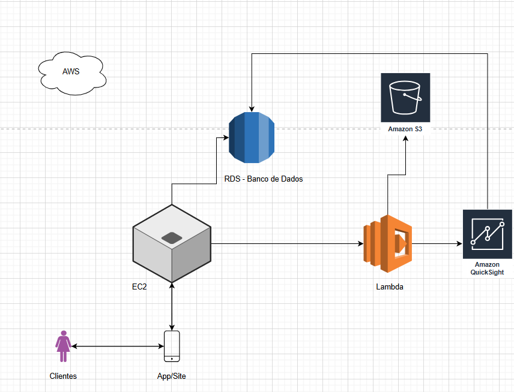

# Projeto de Sistema de Agendamento para Salão de Beleza

#### Este projeto descreve a arquitetura de um sistema de agendamento e análise de dados (Business Intelligence) para um salão de beleza. A plataforma permite que clientes consultem horários disponíveis para serviços (como unhas e cabelos) e realizem agendamentos. Além disso, o sistema fornece painéis de análise de dados para a gerência, permitindo extrair insights valiosos sobre o negócio. **Esse projeto foi inspirado no Salão de Beleza da minha Mãe!** 

## Funcionalidades Principais
#### **Para Clientes:** Consulta de horários disponíveis e agendamento online via App ou Site.
#### **Para Gerência:** Geração de insights mensais, como:

* Faturamento total.
* Serviços mais procurados (unhas, cabelos, etc.).
* Horários de pico.
* Desempenho por profissional.

## Diagrama da Arquitetura

#### Cada serviço da AWS foi escolhido para uma função específica, garantindo que o sistema seja seguro, escalável e eficiente.

#### **Clientes (Usuários):**
* **Função:** São os usuários finais (as clientes do salão) que acessam o sistema.

#### **App/Site (Frontend):**
* **Função:** É a interface visual que o cliente usa, seja um aplicativo de celular ou um site. Ele exibe os horários e permite que o cliente interaja com o sistema.

#### **Amazon EC2 (Elastic Compute Cloud):**
* **Função:** É o "cérebro" da aplicação. Este é o servidor virtual que hospeda o backend (a lógica do seu sistema).
* **No projeto:** Ele recebe as solicitações do App/Site (ex: "a cliente quer marcar às 14h"), processa essa lógica e se comunica com o banco de dados.

#### **Amazon RDS (Relational Database Service):**
* **Função:** É o banco de dados gerenciado. É a "memória" de longo prazo do sistema.
* **No projeto:** Ele armazena todas as informações críticas, como:

    * Cadastro de clientes (nome, telefone).

    * Lista de serviços e preços.

    * Agenda de horários (o que está livre e o que está ocupado).

    * Histórico de agendamentos.

#### **Amazon Lambda:**
* **Função:** É um "trabalhador" automatizado que executa tarefas sem precisar de um servidor ligado 24h.
* **No projeto:** Pode ser usado para tarefas de processamento em segundo plano. Por exemplo, o EC2 pode acionar o Lambda para "gerar o relatório de faturamento do mês" ou "fazer um backup dos dados".

#### **Amazon S3 (Simple Storage Service):**
* **Função:** É um serviço de armazenamento de arquivos (como um "depósito" ou "arquivo morto" na nuvem).
* **No projeto:** Perfeito para guardar os relatórios gerados pelo Lambda (ex: "relatorio_faturamento_outubro.csv") ou para armazenar imagens e outros arquivos estáticos do site.

#### **Amazon QuickSight:**
* **Função:** É a ferramenta de Business Intelligence (BI) da AWS. Ele cria gráficos e painéis interativos.
* **No projeto:** É o componente que realiza a mágica dos insights. Ele se conecta diretamente ao banco de dados (RDS) para ler os dados e transformá-los em informações visuais fáceis de entender para a sua mãe (a gerente do salão).

## Fluxos de Dados (Como Funciona na Prática)
#### O diagrama possui dois fluxos principais que funcionam juntos:

**Fluxo 1:** O Agendamento da Cliente
### Este é o fluxo principal do aplicativo.

1. A Cliente abre o App/Site no seu celular.

2. O App/Site pede ao servidor EC2: "Quais são os horários disponíveis?".

3. O EC2 consulta o banco de dados RDS para ver a agenda e envia a lista de horários livres de volta para o App/Site.

4. A Cliente escolhe um horário (ex: "Quero unhas às 14h").

5. O App/Site envia essa solicitação de volta para o EC2.

6. O EC2 processa o pedido e salva o novo agendamento no RDS, marcando aquele horário como "ocupado".

**Fluxo 2:** A Geração de Insights (BI)
#### Este é o fluxo que permite à gerência analisar o negócio.

1. Durante o mês, o EC2 e o RDS trabalham juntos (no Fluxo 1) e acumulam centenas de registros de agendamentos.

2. Para ver os insights, a gerente (sua mãe) abre o painel do Amazon QuickSight.

3. O QuickSight se conecta diretamente ao RDS e "lê" todos os agendamentos.

4. Ele automaticamente processa esses dados e exibe os gráficos: "Total faturado no mês", "Serviços mais populares", etc., tudo em tempo real.

